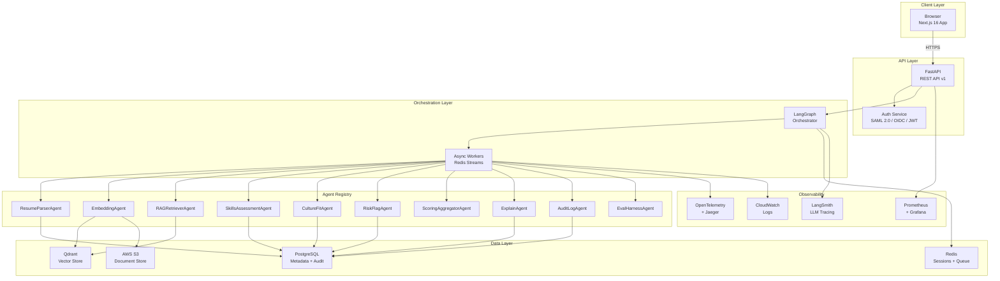
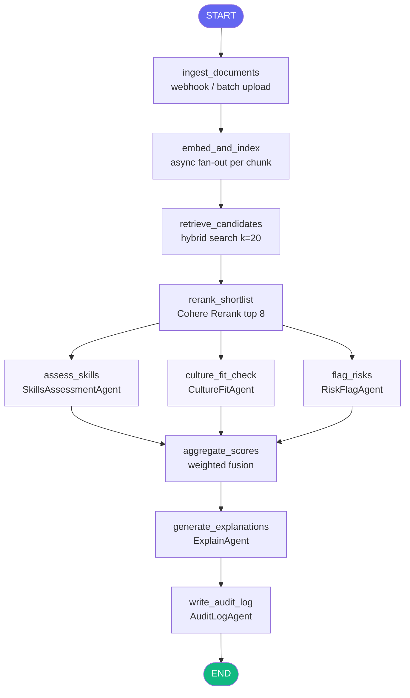
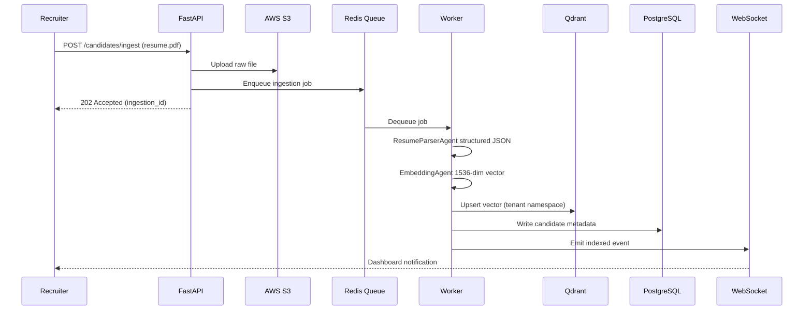
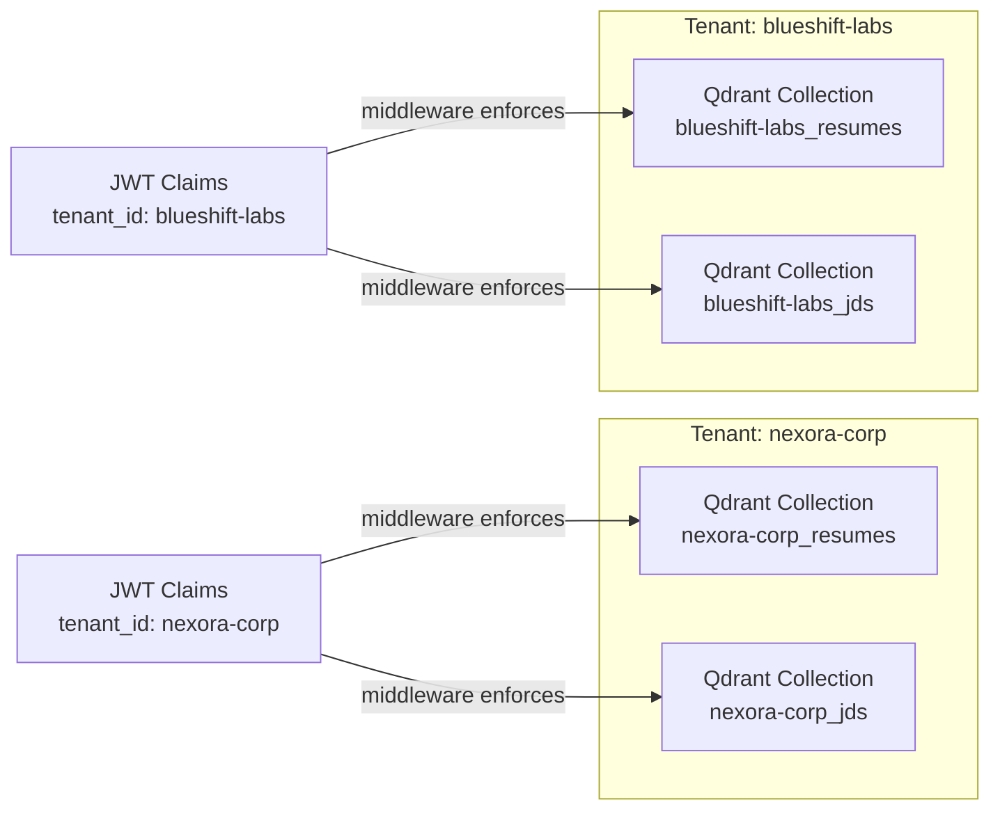
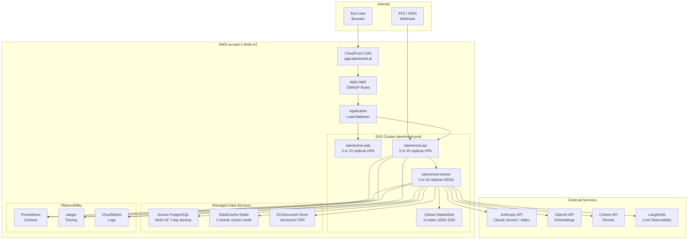

# TalentMind AI — Enterprise Talent Intelligence Platform

> **Hire smarter with Agentic AI.** TalentMind orchestrates RAG pipelines, LangGraph multi-agent workflows, and vector-semantic search to surface the right talent — with full explainability, compliance, and enterprise-grade observability built in.

---

## 1. Project Overview

| Attribute | Detail |
|-----------|--------|
| **Project Name** | TalentMind AI |
| **Version** | 1.0.0 |
| **Type** | Enterprise SaaS — AI-Powered Talent Intelligence Platform |
| **Frontend** | Next.js 16 · TypeScript · Tailwind CSS v4 |
| **Target Users** | Enterprise HR teams, Talent Acquisition leaders, Recruiting Operations |
| **Business Domain** | Human Capital Management · Generative AI · Agentic Workflows |

TalentMind AI is a cloud-native, multi-tenant SaaS platform that automates the enterprise talent acquisition lifecycle using production-grade AI primitives. The platform combines **Retrieval-Augmented Generation (RAG)**, **LangGraph-based agentic orchestration**, and **vector-semantic search** to replace slow, biased, manual hiring processes with explainable, auditable, AI-driven decisions.

The repository contains the **marketing and product landing site** (`talentmind-web`) built on Next.js 16, serving as the public-facing interface of the TalentMind platform — complete with a fully interactive UI, modal-driven user flows, authentication, pricing, and product demonstrations.

---

## 2. Business Problem

Enterprise talent acquisition is broken:

| Challenge | Impact |
|-----------|--------|
| Manual resume screening at scale | Recruiters spend 23 hours screening resumes per hire |
| Inconsistent evaluation criteria | Subjective decisions introduce bias and legal risk |
| No explainability on AI scores | DEI teams cannot trust black-box hiring models |
| Slow time-to-hire | Average enterprise hire takes 44 days; top candidates accept offers in 10 |
| Compliance gaps | EEOC and GDPR requirements are difficult to satisfy without structured audit trails |
| Disconnected tooling | ATS, assessment, and analytics tools do not share a unified data model |

TalentMind directly addresses each of these by providing a single, auditable, AI-orchestrated pipeline — from job requisition to ranked shortlist — that HR teams can trust, explain, and continuously improve.

---

## 3. Objectives

### Primary Objectives
- Automate end-to-end candidate evaluation using multi-agent AI pipelines
- Reduce time-to-shortlist from days to minutes using RAG-powered retrieval
- Deliver explainable AI decisions with full audit trails for compliance

### Technical Objectives
- Build a production-grade Next.js 16 landing experience with interactive modal flows
- Implement a stateful LangGraph orchestration engine for multi-step agent execution
- Design a multi-tenant vector knowledge base with hard namespace isolation
- Achieve 99.97% uptime SLA through Kubernetes-native horizontal autoscaling

### Business Objectives
- Enable enterprise HR teams to reduce cost-per-hire by 40%+
- Achieve 94%+ candidate match accuracy vs. 61% industry average
- Provide SOC 2 Type II, GDPR, and EEOC-ready compliance infrastructure

### Expected Outcomes
- 3.2× faster time-to-hire across enterprise customers
- 500M+ candidate vectors indexed across all tenants
- 68% reduction in time-to-offer for technology hiring roles

---

## 4. Key Features

| Feature | Description | Business Benefit |
|---------|-------------|-----------------|
| **RAG-Powered Talent Retrieval** | Hybrid dense (cosine) + sparse (BM25) search over a Qdrant vector knowledge base of resumes, JDs, and assessments | Surfaces semantically relevant candidates missed by keyword search |
| **LangGraph Multi-Agent Pipeline** | Stateful graph execution with parallel agent branches: SkillsAgent, CultureAgent, RiskFlagAgent, ExplainAgent, AuditLogAgent | Fully automated, configurable assessment with human-in-the-loop checkpoints |
| **Real-Time Embedding Pipeline** | Async document ingestion via Redis Streams; supports PDF, LinkedIn export, GitHub profiles, ATS webhooks | Zero-lag knowledge base updates as new candidates apply |
| **Evaluation & Observability Framework** | RAGAS-style metrics (faithfulness, answer relevance, context precision), LangSmith tracing, Grafana dashboards, Prometheus metrics | Every AI decision is measurable and improvable — no blind spots |
| **Enterprise Auth & Multi-Tenancy** | SAML 2.0 / OIDC SSO, JWT (RS256, 15-min expiry), RBAC (Admin / Recruiter / HiringManager / Viewer), Qdrant collection-per-tenant isolation | Zero cross-tenant data leakage; enterprise SSO on day one |
| **Cloud-Native Deployment** | Helm charts, Terraform IaC modules, GitHub Actions CI/CD, Kubernetes HPA + KEDA autoscaling | Deploy to AWS, GCP, or Azure; scales from 10 to 10,000 pipeline runs/day |
| **GDPR Right to Erasure** | `DELETE /candidates/{id}` removes vectors from Qdrant + metadata from PostgreSQL | Full regulatory compliance for EU customers |
| **Webhook Event System** | HMAC-SHA256 signed webhooks for `ingestion.completed`, `pipeline.completed`, `eval.completed` | Native integration with any ATS, HRIS, or Slack workflow |
| **Interactive Landing UI** | Six distinct modal flows (Demo, Free Trial, Sales, Video, Docs, Sign In), signed-in state with avatar + dropdown | Converts enterprise visitors with context-appropriate CTAs |
| **Pricing & Packaging** | Three-tier pricing (Starter $499/mo, Growth $1,999/mo, Enterprise custom) with distinct conversion flows | Optimised funnel for SMB through Fortune 500 |

---

## 5. Architecture

### 5.1 High-Level System Architecture



### 5.2 LangGraph State Machine



### 5.3 Data Flow — Candidate Ingestion



### 5.4 Multi-Tenancy Model



---

## 6. Tech Stack

### Frontend

| Technology | Version | Purpose |
|------------|---------|---------|
| Next.js | 16.2.4 | React framework with App Router |
| React | 19.2.4 | UI component model |
| TypeScript | 5.x | Static typing, strict mode enabled |
| Tailwind CSS | 4.x | Utility-first styling with custom design tokens |
| Lucide React | 1.22.0 | Professional SVG icon library |
| MUI | 9.x | Material UI component library |
| Plus Jakarta Sans | Google Fonts | Display font |
| Inter | Google Fonts | Body font |

### Backend *(Architecture — referenced in ARCHITECTURE.md)*

| Technology | Version | Purpose |
|------------|---------|---------|
| FastAPI | Latest | Async REST API, OpenAPI 3.1 auto-docs |
| Python | 3.12 | API + orchestrator runtime |
| LangGraph | 0.2 | Stateful multi-agent workflow engine |
| LangChain | Latest | RAG primitives, document loaders, retrievers |
| Anthropic Claude | Sonnet 4.6 / Haiku 4.5 | LLM backbone for all agents |
| OpenAI | Latest | text-embedding-3-large (1536-dim) |
| Cohere | Latest | Rerank v3, embed-english-v3.0 |
| PyMuPDF / unstructured | Latest | Document parsing (PDF, DOCX, HTML) |
| Alembic | Latest | Database migrations |

### Vector & Data

| Technology | Purpose |
|------------|---------|
| Qdrant | Primary vector store (self-hosted, 3-node StatefulSet) |
| Pinecone | Cloud vector store (alternative) |
| PostgreSQL Aurora Serverless | Metadata, audit logs, eval results |
| Redis ElastiCache | Session cache, rate limiting, worker queue (Redis Streams) |
| AWS S3 | Raw document storage with lifecycle policies |

### DevOps & Infrastructure

| Technology | Purpose |
|------------|---------|
| Docker | Multi-stage container builds (web, api, worker) |
| Kubernetes EKS | Container orchestration, HPA + KEDA autoscaling |
| Helm | Kubernetes package management |
| Terraform | Infrastructure as Code (EKS, RDS, ElastiCache, S3, IAM, VPC) |
| GitHub Actions | CI/CD pipeline (lint, test, build, deploy) |
| AWS ECR | Private container registry |
| NGINX Ingress | TLS termination, routing |
| cert-manager | Automated TLS certificate management |

### Observability & Monitoring

| Technology | Purpose |
|------------|---------|
| LangSmith | LangGraph run tracing, eval results, token usage |
| Prometheus | Metrics collection from all services |
| Grafana | Dashboards (pipeline latency, RAG accuracy, LLM cost) |
| OpenTelemetry + Jaeger | Distributed tracing across API + agents |
| Fluent Bit + CloudWatch | Centralised log aggregation |
| PagerDuty + Alertmanager | On-call alerting |
| Checkly | Synthetic monitoring, API contract tests every 5 min |
| RAGAS | RAG evaluation metrics (faithfulness, answer relevance, context precision) |

---

## 7. Folder Structure

```text
talentmind-platform/
├── app/                          # Next.js 16 App Router
│   ├── components/
│   │   └── Navbar.tsx            # Sticky navbar — auth-aware, scroll-adaptive
│   ├── globals.css               # Design tokens, animations, utility classes
│   ├── layout.tsx                # Root layout — fonts, metadata, SEO
│   ├── page.tsx                  # Landing page — all sections + 6 modal flows
│   └── favicon.ico
├── public/                       # Static assets (SVGs)
├── ARCHITECTURE.md               # Full system architecture documentation
├── API.md                        # REST API reference (all endpoints)
├── DEPLOYMENT.md                 # Deployment guide (local to Docker to K8s)
├── next.config.ts                # Next.js configuration
├── tailwind.config.js            # Tailwind theme extensions
├── tsconfig.json                 # TypeScript strict configuration
├── postcss.config.mjs            # PostCSS (Tailwind v4)
├── eslint.config.mjs             # ESLint flat config
├── package.json                  # Dependencies + scripts
└── README.md                     # This file
```

### Key File Descriptions

| File / Folder | Responsibility |
|---------------|---------------|
| `app/page.tsx` | Complete landing page: Hero, Stats, Features, How It Works, Use Cases, Testimonials, Pricing, CTA, Footer + all 6 modals |
| `app/components/Navbar.tsx` | Auth-aware fixed navbar with signed-in state (avatar + dropdown), mobile hamburger, scroll-adaptive background |
| `app/globals.css` | Brand design system — CSS variables, gradient utilities, animation keyframes, card and button base classes |
| `ARCHITECTURE.md` | Full system architecture: component breakdown, LangGraph state machine, Kubernetes layout, security model, data flows |
| `API.md` | Complete REST API reference: auth, candidates, requisitions, pipeline runs, eval, knowledge base, webhooks, error handling |
| `DEPLOYMENT.md` | Step-by-step deployment: local dev, Docker Compose, Terraform provisioning, Helm deployment, CI/CD, production checklist |

---

## 8. API Documentation

> Full reference: [`API.md`](./API.md) · OpenAPI spec: `https://api.talentmind.ai/v1/docs`

**Base URL:** `https://api.talentmind.ai/v1`
**Authentication:** Bearer JWT — obtain via `POST /auth/token`

### Core Endpoints

| Method | Endpoint | Description |
|--------|----------|-------------|
| `POST` | `/auth/token` | Exchange credentials / SAML assertion for JWT |
| `POST` | `/auth/refresh` | Rotate refresh token |
| `POST` | `/auth/saml/callback` | SAML 2.0 IdP callback |
| `POST` | `/candidates/ingest` | Ingest resume PDF / LinkedIn / GitHub profile |
| `GET` | `/candidates` | List candidates (filterable by job, score, status) |
| `GET` | `/candidates/{id}` | Full candidate profile with scores + audit trail |
| `DELETE` | `/candidates/{id}` | GDPR right-to-erasure removal |
| `POST` | `/requisitions` | Create job requisition + embed JD |
| `GET` | `/requisitions/{id}/shortlist` | AI-ranked candidate shortlist |
| `POST` | `/pipelines/run` | Trigger full LangGraph pipeline run |
| `GET` | `/pipelines/{run_id}` | Pipeline run status + RAGAS metrics |
| `GET` | `/pipelines/{run_id}/trace` | LangSmith trace + OpenTelemetry spans |
| `POST` | `/eval/run` | Run evaluation harness on pipeline output |
| `GET` | `/eval/{eval_id}/results` | RAGAS metrics + per-candidate accuracy |
| `GET` | `/knowledge-base/stats` | Tenant vector store statistics |
| `POST` | `/knowledge-base/search` | Direct semantic search (debugging / BI) |
| `POST` | `/webhooks` | Register HMAC-signed event webhook |

### Rate Limits

| Plan | API calls/min | Pipeline runs/hour | Vectors/day |
|------|--------------|-------------------|-------------|
| Starter | 60 | 10 | 1,000 |
| Growth | 600 | 100 | 50,000 |
| Enterprise | Unlimited | Unlimited | Unlimited |

### Error Format (RFC 7807)

```json
{
  "type": "https://api.talentmind.ai/errors/insufficient-vectors",
  "title": "Insufficient indexed vectors",
  "status": 422,
  "detail": "The requisition requires at least 10 candidate vectors.",
  "trace_id": "otel_trace_abc123"
}
```

---

## 9. Security Implementation

| Layer | Control |
|-------|---------|
| **Authentication** | SAML 2.0 / OIDC SSO · JWT RS256 (15-min expiry) · Refresh token rotation |
| **Authorization** | RBAC — Admin, Recruiter, HiringManager, Viewer · Tenant middleware on every request |
| **Transport** | TLS 1.3 enforced everywhere · HSTS preload · No HTTP allowed |
| **Data at Rest** | AES-256 (S3, RDS, EBS) · Qdrant collection-level encryption |
| **Secrets Management** | AWS Secrets Manager → Kubernetes ExternalSecrets · No secrets in environment files |
| **Network** | Private subnets · Security Group allow-lists · No public RDS / Qdrant endpoints |
| **Application** | WAF (OWASP Core Rule Set) on ALB · SAST (Semgrep) in CI · ECR image scanning |
| **Compliance** | SOC 2 Type II · GDPR (right-to-erasure API) · EEOC audit logs per pipeline run |
| **LLM Security** | All LLM inputs/outputs logged with PII redaction · Prompt injection detection |
| **Webhook Security** | HMAC-SHA256 signatures on all event payloads (`X-TalentMind-Signature`) |

---

## 10. CI/CD Pipeline

```mermaid
flowchart LR
    Dev["Developer\nPush / PR"] --> GH["GitHub\nActions"]

    subgraph PR["On Pull Request"]
        L["Lint and\nType Check\nESLint · mypy · ruff"]
        UT["Unit Tests\njest · pytest"]
        IT["Integration Tests\ndocker-compose\npytest integration"]
        BI["Build Images\ndocker buildx\nlinux/amd64"]
        EV["Eval Pipeline\nCheck\n50-sample fixture"]
        L --> UT --> IT --> BI --> EV
    end

    subgraph Merge["On Merge to main"]
        ECR["Push Images\nto ECR\ngit SHA tag"]
        STG["Deploy Staging\nhelm upgrade\nwait"]
        SMK["Smoke Tests\nk6 + contract tests"]
        APR["Manual\nApproval Gate"]
        PRD["Deploy Production\nhelm upgrade\nwait"]
        VFY["Post-Deploy\nVerify\nCheckly synthetic"]
        ECR --> STG --> SMK --> APR --> PRD --> VFY
    end

    GH --> PR
    EV --> ECR
```



### Pipeline Stage Durations

| Stage | Duration |
|-------|---------|
| Lint & Type Check | ~2 min |
| Unit Tests | ~4 min |
| Integration Tests | ~8 min |
| Build Images | ~6 min |
| Eval Pipeline Check | ~5 min |
| Deploy Staging | ~3 min |
| Smoke Tests | ~4 min |
| Deploy Production | ~5 min |

---

## 11. Deployment Architecture



### Infrastructure Components

| Component | Configuration | Purpose |
|-----------|--------------|---------|
| EKS | 3 AZs, managed node groups | Container orchestration |
| Aurora PostgreSQL | Multi-AZ, serverless v2, 7-day backup | Metadata, audit logs |
| ElastiCache Redis | Cluster mode, 3 shards | Sessions, queue, rate limiting |
| Qdrant StatefulSet | 3 nodes, 100Gi SSD PVC each | Vector knowledge base |
| AWS S3 | Versioning, lifecycle rules, CRR | Raw document storage |
| CloudFront | Global CDN | Web app delivery |
| AWS WAF | OWASP Core Rule Set | Edge security |

---

## 12. Monitoring & Observability

| Tool | What It Monitors |
|------|-----------------|
| **LangSmith** | Every LangGraph run — node-level traces, token usage, eval scores, agent errors |
| **Prometheus** | Pipeline latency, RAG accuracy over time, LLM cost per agent, queue depth |
| **Grafana** | 5 dashboards: Pipeline Overview, RAG Accuracy, LLM Usage, Vector Store Health, Tenant SLA |
| **OpenTelemetry + Jaeger** | Distributed traces spanning API, orchestrator, and agents |
| **Fluent Bit + CloudWatch** | Structured application logs (365-day retention, immutable for compliance) |
| **PagerDuty + Alertmanager** | On-call rotation; alerts on SLA breach, error spike, queue depth threshold |
| **Checkly** | Synthetic API contract tests every 5 minutes against production endpoints |
| **RAGAS** | Nightly batch evaluation: faithfulness, answer relevance, context precision, match accuracy |

### Key Metrics Tracked

| Metric | Target |
|--------|--------|
| `ragas_faithfulness` | ≥ 0.92 |
| `ragas_answer_relevance` | ≥ 0.90 |
| `candidate_match_accuracy` | ≥ 0.93 |
| `pipeline_p99_latency_ms` | ≤ 60,000 |
| `ingestion_throughput_docs_s` | ≥ 5 |
| `bias_detection_rate` | ≤ 0.02 |

---

## 13. Installation & Setup

### Prerequisites

| Tool | Required Version |
|------|----------------|
| Node.js | ≥ 20.9.0 LTS |
| npm | ≥ 10 |
| nvm (recommended) | Latest |

### Clone & Run

```bash
# Clone the repository
git clone https://github.com/Skillfyme-R/talentmind-platform.git
cd talentmind-platform

# Install Node.js 20 (if not already)
nvm install 20
nvm use 20

# Install dependencies
npm install

# Start development server
npm run dev
```

Open [http://localhost:3000](http://localhost:3000)

### Available Scripts

| Script | Command | Description |
|--------|---------|-------------|
| Development | `npm run dev` | Next.js dev server with Turbopack |
| Build | `npm run build` | Production build |
| Start | `npm run start` | Serve production build |
| Lint | `npm run lint` | ESLint code check |
| Type Check | `npx tsc --noEmit` | TypeScript strict type check |

### Full Stack Local Development (Docker Compose)

```bash
docker compose -f docker-compose.dev.yml up -d
```

| Service | Port |
|---------|------|
| talentmind-web | 3000 |
| talentmind-api | 8000 |
| PostgreSQL | 5432 |
| Redis | 6379 |
| Qdrant HTTP | 6333 |
| Qdrant gRPC | 6334 |

### Key Environment Variables

```env
# Web app (.env.local)
NEXT_PUBLIC_API_URL=http://localhost:8000/v1
NEXT_PUBLIC_APP_ENV=development

# API (.env)
ANTHROPIC_API_KEY=sk-ant-...
OPENAI_API_KEY=sk-...
COHERE_API_KEY=...
LANGCHAIN_API_KEY=ls__...
TALENTMIND_DB_URL=postgresql+asyncpg://...
TALENTMIND_QDRANT_URL=http://localhost:6333
TALENTMIND_REDIS_URL=redis://localhost:6379/0
```

---

## 14. Challenges & Learnings

### Technical Challenges

| Challenge | Solution |
|-----------|---------|
| Next.js 16 breaking changes | Migrated to App Router conventions; adopted new font loading API and metadata patterns |
| Tailwind CSS v4 config | Migrated from JS config to CSS-native `@theme` layer for design tokens |
| Multi-tenant vector isolation | Implemented Qdrant collection-per-tenant model rather than payload filtering to guarantee hard namespace boundaries |
| LangGraph parallel agent execution | Designed fan-out pattern with `assess_skills`, `culture_fit_check`, `flag_risks` running concurrently, merging at `aggregate_scores` |
| RAG accuracy vs. latency tradeoff | Tuned hybrid search weight (0.7 dense / 0.3 sparse) and Cohere Rerank top-n to achieve 94% accuracy within 45-second pipeline SLA |

### Architecture Decisions

| Decision | Rationale |
|----------|----------|
| LangGraph over custom orchestration | Native state persistence, built-in human-in-the-loop support, LangSmith observability out of the box |
| Qdrant over Pinecone | Self-hostable on Kubernetes, no per-vector pricing, HNSW parameter control, collection-level encryption |
| Claude Sonnet for parsing and explanation | Superior instruction-following for structured extraction; best-in-class rationale generation for DEI trust |
| Redis Streams for ingestion queue | Native consumer group semantics, at-least-once delivery, replay capability for audit |
| KEDA for worker autoscaling | Event-driven scaling based on Redis queue depth — zero workers at idle, burst to 16 at peak |

### Key Learnings

- **Explainability is a product requirement**, not a nice-to-have — DEI teams will not adopt AI hiring tools that cannot explain their decisions in natural language
- **Evaluation must be continuous** — RAGAS metrics drifted +3% when embedding model was updated; nightly eval harness caught it before it reached production
- **Multi-tenancy at the vector layer** is non-negotiable for enterprise — payload filtering is not sufficient when tenants have contractual data isolation guarantees

---

## 15. Future Enhancements

| Enhancement | Priority | Business Impact |
|-------------|---------|----------------|
| Internal Mobility Module | High | 2.8× higher internal placement rate; reduce external hiring cost by 30% |
| Skills Graph Database (Neo4j) | High | Precise gap analysis and upskilling path generation |
| Video Interview AI Analysis | Medium | Automated behavioural signal extraction from recorded interviews |
| Diversity & Inclusion Dashboard | High | Real-time bias detection across the hiring funnel; EEOC report generation |
| ATS Native Integrations | High | Workday, Greenhouse, Lever, iCIMS connectors — zero-friction onboarding |
| Fine-Tuned Domain Models | Medium | LoRA fine-tuning on enterprise hiring corpora for improved domain accuracy |
| Candidate Self-Service Portal | Medium | Match score transparency; GDPR data access request handling |
| A/B Testing Framework | Medium | Compare retrieval strategies, rerankers, and agent configurations in production |
| Multi-Region Active-Active | Low | Sub-100ms API latency for EU and APAC tenants; data residency compliance |
| Recruiter AI Co-Pilot | Low | Browser extension that scores candidates live as recruiter reviews LinkedIn profiles |

---

## License

&copy; Learnsyte Learning Private Limited (Skillfyme). All rights reserved.

This project and its source code are the intellectual property of Learnsyte Learning Private Limited (Skillfyme). Unauthorised reproduction, distribution, or use of any part of this codebase without written permission is strictly prohibited.

---

<div align="center">

**Built with LangGraph &nbsp;·&nbsp; Qdrant &nbsp;·&nbsp; Claude &nbsp;·&nbsp; Next.js &nbsp;·&nbsp; TypeScript**

*TalentMind AI — Enterprise Talent Intelligence Platform*

</div>
